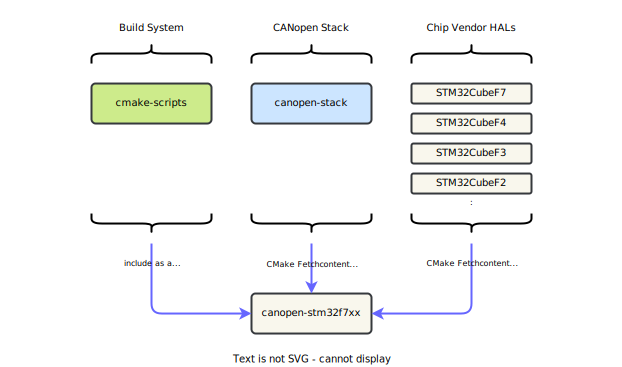

# Installation

With version 4.4 the CANopen Stack project introduces an ecosystem, which supports you in project management. This is realized by using multiple repositories with independent version management for important aspects of an embedded software project setup:

- **[cmake-scripts][3]** - this repository is responsible for the embedded toolchains and the component package management.
- **[canopen-stack][1]** - this repository represents the platform independent CANopen stack component.
- **[canopen-stm32f7xx][4]** - this repository contains a complete Quickstart example setup for the device STM32F769. The adaption to other devices out of the STM32F7 series are small.
- **[STM32CubeF7][5]** - this fork of the ST Microelectronics HAL package is integrated into the CMake build system and packaged with minimal required source files to get the ST HAL/LL drivers working (No middleware and documentation).

<figure markdown>
  { width=700px }
</figure>

## Add Component in CMake (recommended)

The build system is realized with [CMake][7] and the [CPM.cmake][6] package management. See [cmake-scripts][3] for details. Including the CANopen Stack into the project is done during the configuration phase of the build environment. During this phase, the CANopen Stack is fetched in the defined version and is available for usage.

```cmake
set(CO_TARGET   "canopen-stack")
set(CO_PROJECT  "embedded-office/canopen-stack")
set(CO_VERSION  "4.4.0")
CPMAddPackage(
  NAME    ${CO_TARGET}
  URL     https://github.com/${CO_PROJECT}/releases/download/v${CO_VERSION}/${CO_TARGET}-src.zip
  VERSION ${CO_VERSION}
)
```

## Getting the Source

When you just want to use the source code of the platform independent CANopen Stack, all you need to do is getting the repository [canopen-stack][1] and use the files in your prefered build system. There are multiple ways in getting the source code:

### Clone Repository

Clone the [canopen-stack][1] repository from github. This is good if you want to review and merge future updates into your project:

```
git clone https://github.com/embedded-office/canopen-stack.git
```

### Download ZIP File

Download and unzip the file from the [canopen-stack][1] repository. This is good if you want to work on hosts without internet access.

- Click on `Releases`
- Download the package `canopen-stack-src.zip`
- Unzip the archive to your local drive

!!! Note

    This is exactly what the CMake command `CPMAddPackage()` does during project configuration.

### Fork Repository

Fork the github repository [canopen-stack][1] into your GitHub account. This is good if you want to collaborate enhancements or bugfixes to the project. Any improvement of the project is highly welcome.

## Cross-compile for Target

Add the source files and include paths to a library project (see [Repository Structure][2]). Create a library with your cross-compiler and share this library together with the include files with your embedded software project.

!!! Note

    This is exactly what the CMake command `CPMAddPackage()` prepares during project configuration.


[1]: https://github.com/embedded-office/canopen-stack
[2]: ../structure
[3]: https://github.com/embedded-office/cmake-scripts
[4]: https://github.com/embedded-office/canopen-stm32f7xx
[5]: https://github.com/embedded-office/STM32CubeF7
[6]: https://github.com/cpm-cmake/CPM.cmake
[7]: https://cmake.org/
