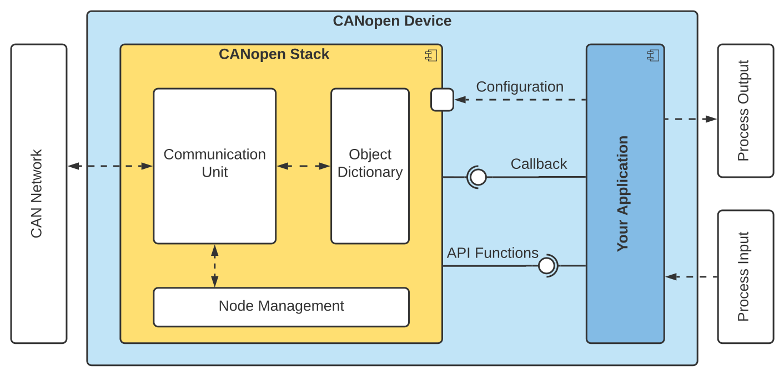
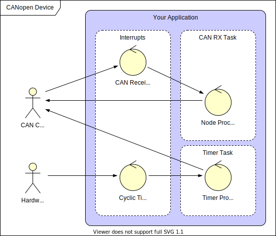

# RTOS and Baremetal

This example describes the usage and differences when using the CANopen Stack with an RTOS or within a foreground / background system. The overall architecture of a CANopen device is standardized and shown in the following figure:

<figure markdown>
  { width=640px }
</figure>

In this example, only the high-level usage within the component **Your Application** is addressed. We focus the description in the examples to the startup, event service, and CANopen stack processing API functions:

| Function Name                                 | Description                            |
| --------------------------------------------- | -------------------------------------- |
| [`CONodeInit()`](/api/node/#conodeinit)       | Initialization of CANopen stack        |
| [`CONodeStart()`](/api/node/#conodestart)     | Start of CANopen stack                 |
| [`CONodeProcess()`](/api/node/#conodeprocess) | Processing of CAN communication        |
| [`COTmrService()`](/api/timer/#cotmrservice)  | Trigger elapsed configured time quanta |
| [`COTmrProcess()`](/api/timer/#cotmrprocess)  | Processing of timed actions            |

## CANopen Baremetal

When using the CANopen stack in a foreground / background system, we establish a timer interrupt for triggering the elapsed time quantum and the CAN receive interrupt.

The following figure shows an overview of the application:

<figure markdown>
  { width=480px }
</figure>

The figure shows the hardware components which drives the CANopen stack operation. The **CAN Controller** is the interface to the CAN network. The **Hardware Timer** is the time base for all timed actions of the CANopen stack.

Both hardware components are generating asynchronous events. We handle these events with the interrupt service routines (ISR) *CAN Receive ISR* and *Cyclic Timer ISR*.

The processing of the collected events is checked and processed in the main loop controls *Node Processing* and *Timer Processing*. The *Node Processing* is responsible for all CAN communication requests. The *Time Processing* is responsible for all timed actions.

### CANopen Node Startup

The following source shows the global variables and the initialization and startup of the CANopen device node.

The external variable `AppSpec` is a part of the CANopen configuration, see quickstart for details. The global variable `MyNode` represents the CANopen node itself.

```c
/* get external node specification */
extern const CO_NODE_SPEC AppSpec;

/* Allocate a global CANopen node object */
CO_NODE MyNode;
```

The `main()` function is responsible for the initialization and startup activities for the CANopen device.

```c
void main(int argc, char *argv[])
{
  /* Initialization of Hardware:
   * - Setup cyclic timer interrupt source
   * - Setup CAN bus operation
   */

  /* Startup of CANopen stack */
  CONodeInit (&MyNode, (CO_NODE_SPEC *)&AppSpec);
  CONodeStart(&MyNode);

  /* The background loop */
  FOREVER {
    :
  }
}
```

### CAN Receive ISR

The following function handles the CAN receive interrupt.

```c
void App_CanRxIsrHandler(void)
{
  CONodeProcess(&MyNode);
}
```

### Cyclic Timer ISR

The following source lines handles the cyclic timer interrupt.

```c
void App_TmrIsrHandler(void)
{
  /* Hardware timer handling (e.g. interrupt acknowledge) */

  COTmrService(&(MyNode.Tmr));
}
```

### Background Loop

The following source lines shows the background loop function calls.

```c
void main(int argc, char *argv[])
{
  :
  /* The background loop */
  FOREVER {
    COTmrProcess (&(MyNode.Tmr));
      :
    /* other application functions */
      :
  }
}
```

## CANopen with RTOS

When using the CANopen stack with an RTOS, we establish a timer interrupt for triggering the elapsed time quantum and the CAN receive interrupt.

The following figure shows an overview of the application:

<figure markdown>
  { width=480px }
</figure>

The figure shows the hardware components which drives the CANopen stack operation. The **CAN controller** is the interface to the CAN network. The **Hardware Timer** is the time base for all timed actions. Within your RTOS, there is most likely a callback function which you can use as time service trigger.

Both hardware components are producing asynchronous events. We collect these events by the interrupt service routines (ISR) **CAN Receive ISR** and **Cyclic Timer ISR**.

For the processing of the events we use two separate tasks for **Node Processing** and **Timer Processing**. The *Node Processing* is responsible for all CAN communication requests. The *Time Processing* is responsible for all timed actions.

### RTOS Startup

Let's have a look in the implementation for the [Flexible Safety RTOS](https://www.embedded-office.com/products/flexible-safety-rtos). There is no limitation to this RTOS; you can use any RTOS you already have or want.

The following source shows the global variables and the initialization and startup of the CANopen device node.

The external variable `AppSpec` is a part of the CANopen configuration, see quickstart for details. The global variable `MyNode` represents the CANopen node itself.

```c
/* get external node specification */
extern const CO_NODE_SPEC AppSpec;

/* Allocate CANopen node object */
CO_NODE MyNode;

/* Allocate RTOS semaphores */
OS_EVENT *AppCanSem;
OS_EVENT *AppTmrSem;
```

The `main()` function is responsible for the initialization and startup activities for the Flexible Safety RTOS.

```c
void main(int argc, char *argv[])
{
  /* Initialize and start CANopen stack */
  CONodeInit (&MyNode, (CO_NODE_SPEC *)&AppSpec);
  CONodeStart(&MyNode);

  /* Initialize and start real time kernel */
  OSInit ();
  OSTaskCreate (AppStart, ... );
  OSStart();
}
```

### CANopen Node Startup

The first created application task `AppStart` is responsible for the initialization of the peripherals and the creation of the operational application tasks. At the end this task deletes itself.

```c
void AppStart(void *arg)
{
  /* Initialization of Hardware:
   * - setup cyclic OS tick timer
   * - Setup CAN bus operation
   */

  /* Create RTOS semaphores */
  AppTmrSem = OSSemCreate(0);
  AppCanSem = OSSemCreate(0);

  /* Create CANopen tasks */
  OSTaskCreate (AppTmrTask, ... );
  OSTaskCreate (AppRxTask, ... );
    :
  /* Create other application tasks */
    :
  OSTaskDel(OS_PRIO_SELF);
}
```

### CAN Receive ISR

The following function handles the CAN receive interrupt.

```c
void App_CanRxIsrHandler(void)
{
  /* Signal the received CAN frame */
  OSSemPost(AppTmrSem);
}
```

### Cyclic Timer ISR

The following source lines handles the cyclic timer event within the OS specific time tick hook function (a function which is called every OS time tick).

```c
void App_TimeTickHook(void)
{
  int16_t num;

  num = COTmrService(&(MyNode.Tmr));
  while (num > 0) {
    /* Signal all elapsed timer actions */
    OSSemPost(AppTmrSem);
    num--;
  }
}
```

### Rx Task

The following source lines shows the CAN receive task. This task is waiting with the counting semaphore `AppCanSem` for received CAN messages.

```c
void AppCanTask(void *arg)
{
  FOREVER {
    OSSemPend(AppCanSem, ...);
    CONodeProcess(&MyNode);
  }
}
```

### Timer Task

The following source lines shows the timer task. This task is waiting with the counting semaphore `AppTmrSem` for elapsed timer actions.

```c
void AppTmrTask(void *arg)
{
  FOREVER {
    OSSemPend(AppTmrSem, ...);
    COTmrProcess(&(MyNode->Tmr));
  }
}
```
