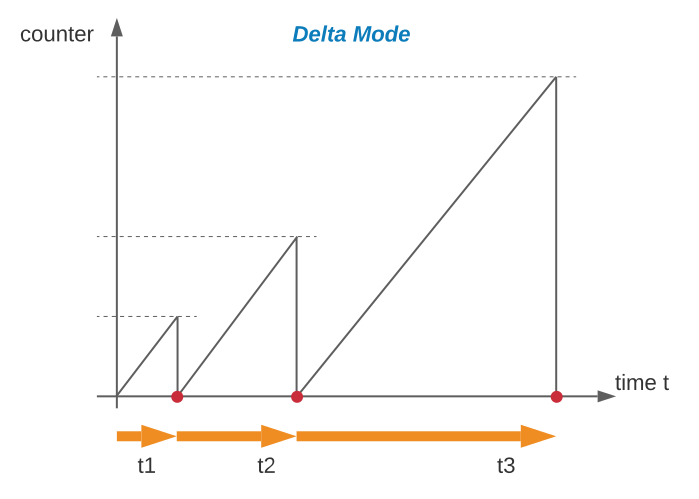

# Timer Driver

## Timer Modes

As a source for CANopen timer management, we need some kind of interrupt which is related to real-time. We distinguish between two different modes for generating the needed time intervals out of the real-time related interrupt: the **Cyclic Mode** and the **Delta Mode**.

### Cyclic Mode

In this mode, a periodic interrupt source is (re-)used. The period time of the interrupts represents the granularity for the generation of needed time intervals.

<figure markdown>
{ width=480px }
</figure>

- no dedicated hardware timer required

- small and easy timer implementation

### Delta Mode

In this mode, a hardware timer is used as a source for the interrupts. The input clock frequency of the timer represents the granularity for the generation of needed time intervals.

<figure markdown>
{ width=480px }
</figure>

- interrupt occurs only when needed

- higher accuracy of time intervals possible

## Timer Driver Functions

The timer driver contains a set of functions, which are called at specific locations within the CANopen stack.

| driver function | calling location                           |
| --------------- | ------------------------------------------ |
| `Init()`        | during initialization of CANopen node      |
| `Reload()`      | when running time interval is elapsed      |
| `Delay()`       | when the needed time interval is created   |
| `Stop()`        | when last running time interval is deleted |
| `Start()`       | when the first time interval is created    |
| `Update()`      | when timer interrupt occurs                |

### Timer Init

This driver function is called during the initialization phase of the CANopen stack. The function is intended to prepare the real-time related interrupt.

```c
void DrvTimerInit(uint32_t freq);
```

The required implementation depends on time generation mode:

- *Cyclic Mode* - the function initializes the internal driver variables for counting the periodic interrupts (and ignores the given frequency `freq`).

- *Delta Mode* - the function initializes a hardware timer with the given frequency `freq` as timer counting frequency.

### Timer Reload

This driver function is called when a running time interval is elapsed. The function is intended to prepare the next needed time interval.

```c
void DrvTimerReload (uint32_t reload);
```

The required implementation depends on time generation mode:

- *Cyclic Mode* - the function sets the internal driver interrupt counting variable to the given number of interrupts: `reload`.

- *Delta Mode* - the function uses the value `reload` to setup the hardware timer for the next needed interrupt.

### Timer Delay

This driver function is called during creating a needed time interval. This function is intended to return the number of ticks before the current running time is elapsed.

```c
uint32_t DrvTimerDelay(void);
```

The required implementation is independent of the time generation mode.

### Timer Stop

This driver function is called after deleting or elapsing of the last needed time interval. This function is intended to stop further interrupts.

```c
void DrvTimerStop(void);
```

The required implementation depends on time generation mode:

- *Cyclic Mode* - the function may optionally reset the internal driver interrupt counting variable. The interrupt are still generated (by the (re)used source), but have no impact on the timer management.

- *Delta Mode* - the function stops the hardware timer to avoid unnecessary interrupts.

### Timer Start

This function is called after creating the first needed time interval. This function is intended to enable the interrupts.

```c
void DrvTimerStart(void);
```

The required implementation depends on time generation mode:

- *Cyclic Mode* - the function is most likely empty because the interrupts are (re)used from an independent source.

- *Delta Mode* - the function starts the hardware timer to get the already programmed timer interrupts.

### Timer Update

This function is called when a real-time related interrupt occurs. This function is intended to update the timer driver state.

```c
uint8_t DrvTimerUpdate(void);
```

The required implementation depends on time generation mode:

- *Cyclic Mode* - the function counts the amount of cyclic interrupts and indicates an elapsed time interval by returning `(uint8_t)1u`.

- *Delta Mode* - this function returns always an elapsed time interval `(uint8_t)1u` because each interrupt represents a needed time interval.

## Timer Driver Integration

During the design of the driver interface for usage with the CANopen stack, we want to decouple the CANopen library from the driver implementation. At the same time, we want to keep the overall usage as easy as possible.

The solution for this requirement is the implementation of the timer driver function as static functions within a single file and an allocated interface structure of type `CO_IF_TIMER_DRV`:

```c
#include "co_if.h"
   :
static void     DrvTimerInit   (uint32_t freq);
static void     DrvTimerReload (uint32_t reload);
static uint32_t DrvTimerDelay  (void);
static void     DrvTimerStop   (void);
static void     DrvTimerStart  (void);
static uint8_t  DrvTimerUpdate (void);
   :
const CO_IF_TIMER_DRV <MyDeviceDriverName>TimerDriver = {
  DrvTimerInit,
  DrvTimerReload,
  DrvTimerDelay,
  DrvTimerStop,
  DrvTimerStart,
  DrvTimerUpdate
};
```

With this kind of implementation, the usage is simply the import of the interface structure as an external symbol, and we are ready to go:

```c
  :
extern const CO_IF_TIMER_DRV <MyDeviceDriverName>TimerDriver;
  :
```

To keep the drivers organized, we put the implementation in a file which follows the naming convention: `co_timer_<my-device-driver-name>.c`, and the declaration of the external symbol in the corresponding header file `co_timer_<my-device-driver-name>.h`.

### Timer Driver Template

The files `/driver/source/co_timer_dummy.c` and `/driver/include/co_timer_dummy.h` are templates for timer drivers.
